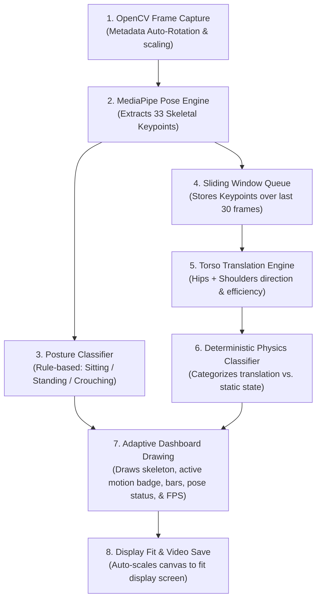

# HRI Human Motion Recognizer (Physics-based Torso Translation Engine)

A real-time, high-precision motion classification pipeline designed for Human-Robot Interaction (HRI) scenarios. The system processes video streams (webcam or portrait/landscape files), extracts skeletal keypoints using MediaPipe Pose, and classifies motion trajectories using a deterministic physics engine that tracks torso translation and scale changes.

This module has been upgraded to support the **HRI Dataset Table** scenarios, utilizing a robust 8-class movement taxonomy optimized for human intent recognition in Classroom and Kitchen environments.

---

## 📋 Project Overview

### **Objective**
To develop a high-precision, real-time HRI monitoring system capable of understanding:
1. **Pose:** Physical posture (e.g., "Sitting", "Standing", "Crouching") evaluated frame-by-frame using geometric rules.
2. **Motion:** Translation and velocity in 3D relative to the camera (e.g., "Standing Still", "Walking", "Walk Across", "Run Backward", "Run (Fast Movement)", "Leaning Forward", "Frozen/Rigid Stand") evaluated using translation consistency over a sliding window.

These motion cues represent the **Motion** component of the **4-Cue HRI Framework** (Emotion + Gesture + Motion + Context), which fuse together to predict the user's intent.

---

## 🔄 System Flow & Pipeline

The diagram below details the stages that every video frame goes through in real time:



---

## 📊 HRI Scenario Motion Taxonomy

The upgraded motion recognition module supports **8 motion classes** mapping directly to the scenarios defined in the HRI Dataset Table:

| Class ID | Upgraded Motion Class | Scenario Behavior | Scenarios Using It (Classroom & Kitchen) |
| :---: | :--- | :--- | :--- |
| **0** | **Sitting Still** | Seated, minimal movement | #1, #3, #4, #7, #11, #12, #14, #21, #28, #33 |
| **1** | **Standing Still** | Standing, natural posture | #5, #9, #18, #22, #24, #35, #36, #37, #38 |
| **2** | **Walking** | Normal pace approach/retreat (Z-axis change) | #2, #6, #16, #20, #23, #26, #27, #29 |
| **3** | **Walk Across** | Lateral walking movement (X-axis change) | #8, #17, #25 |
| **4** | **Run Backward** | Fast backward retreat (Z decreases rapidly) | #19 |
| **5** | **Run (Fast Movement)** | Fast movement in any direction | #30 |
| **6** | **Leaning Forward** | Upper body tilting toward the camera | #13 |
| **7** | **Frozen/Rigid Stand** | Standing completely rigid (freeze response) | #34, #38 |


---

## 🛠️ Dataset Generation (Phase 1)

### **Script**: [1_prepare_dataset_v2.py](file:///d:/FYP/FYP_Motion%20&%20Gesture/motion_final/model_train/1_prepare_dataset_v2.py)
This script programmatically simulates human skeletal movements based on MediaPipe's 33-point pose model. It generates **1,800 total sequences** (200 samples × 9 classes).

### **How the synthetic movement is modeled:**
1. **Pose Templates**: Uses base 3D coordinates representing a **Standing Pose** (full height), **Sitting Pose** (hips lowered, knees bent), and **Leaning Pose** (shoulders and head shifted forward in depth Z).
2. **Trajectory Simulation**:
   - *Walking/Running:* Linearly shifts the coordinates across frames (X for lateral movements, Z for depth).
   - *Bobbing & Arm Swings:* Adds sine wave oscillations to simulate vertical walking bobbing (Y-axis) and arm swinging relative to joint frequencies.
3. **Data Augmentations (Robustness)**:
   - *Jitter Noise:* Adds random Gaussian noise to all keypoints.
   - *Starting Positions:* Randomly offsets the starting coordinate center in the X and Y axes.
   - *Scale Variation:* Randomly scales the entire skeleton (0.85x to 1.15x) to simulate different heights and distances.
   - *Speed Variation:* Randomly alters movement speed (0.7x to 1.5x) to prevent overfitting to fixed velocities.
   - *Mirroring:* Automatically mirrors lateral motions (walking left vs. right).

Each generated sequence is saved as a NumPy file (`.npy`) of shape `(30, 33, 3)` under `extracted_keypoints_v2/`.

---

## 🧠 Model Architecture & Training (Phase 2)

### **Script**: [2_train_and_evaluate_v2.py](file:///d:/FYP/FYP_Motion%20&%20Gesture/motion_final/model_train/2_train_and_evaluate_v2.py)

### **Model Architecture Specifications**
- **Input Dimensions**: 99 features per time step (33 keypoints × 3 coordinates `[x, y, z]`).
- **Recurrent Core**: **3 stacked LSTM layers** (hidden size = 128, dropout = 0.4) to capture complex temporal dependencies.
- **Classification Head (Fully Connected Block)**:
  - Linear Layer (128 -> 64) -> ReLU -> Dropout (0.4)
  - Linear Layer (64 -> 32) -> ReLU -> Dropout (0.4)
  - Output Linear Layer (32 -> 9 classes)
- **Features Used**: Frame-to-frame coordinate differences (velocities) scaled by **100.0** to optimize gradient convergence.
- **Sequence Length**: 29 time steps (derived from 30 coordinate frames).

### **Training Configuration**
- **Loss Function**: Cross-Entropy Loss
- **Optimizer**: Adam (learning rate = 0.001, weight decay = 1e-5)
- **Scheduler**: `ReduceLROnPlateau` (drops learning rate by 50% on plateau)
- **Epochs**: 100 | **Batch Size**: 32
- **Saved Weights**: `models/motion_lstm_v2_best.pth` and `models/motion_lstm_v2_final.pth`

### **Evaluation Results**
- **Validation Accuracy**: **88.89%**
- **Macro F1-Score**: **85.19%**

> [!NOTE]
> **Sitting Still vs. Frozen/Rigid Stand**
> Because the LSTM operates purely on *velocity* features (frame-to-frame difference), "Sitting Still" and "Frozen/Rigid Stand" are mathematically identical (both have zero velocity). In validation, all 40 Sitting Still samples are predicted as Frozen/Rigid Stand.
> However, because our system incorporates the rule-based [PoseClassifier](file:///d:/FYP/FYP_Motion%20&%20Gesture/motion_final/action_recognizer.py#L90), the posture is correctly identified as `Sitting` or `Standing` on the visual dashboard. This allows downstream decision models to cleanly separate these scenarios.

---

## 🎮 Usage Guide

> [!IMPORTANT]
> Always execute python scripts using the virtual environment interpreter (`.\env\Scripts\python.exe`) to ensure package dependencies are loaded.

### **1. Run Real-Time Inference on Live Webcam**
Uses the default connected webcam:
```powershell
.\env\Scripts\python.exe action_recognizer.py --webcam
```

### **2. Select and Run on a Single Video File**
Interactively lists all videos in `testVideo/` and `testVideo2/` (phone portrait) and prompts you to select one to play:
```powershell
.\env\Scripts\python.exe run_single_video.py
```
Or run directly by specifying a path:
```powershell
.\env\Scripts\python.exe action_recognizer.py --video testVideo2/2026_06_05_10_56_10_IMG_3472.MOV
```

### **3. Batch Process and Save Annotated Outputs**
Loops through all videos inside the specified folder, displays the real-time processing window on screen, and writes the annotated visual dashboards to `output/`:
```powershell
# Process testVideo
.\env\Scripts\python.exe run_all_and_save.py --folder testVideo

# Process phone videos
.\env\Scripts\python.exe run_all_and_save.py --folder testVideo2 --output output/phone_output
```

### **4. Run Headless Batch Processing (Background Mode)**
Process and save videos in the background without opening the OpenCV display windows:
```powershell
.\env\Scripts\python.exe run_all_and_save.py --folder testVideo2 --no-show
```

---

## 📁 Cleaned Project Structure

The repository contains only the necessary files for clean execution:

```
motion_final/
├── action_recognizer.py        # Core real-time inference script & UI dashboard
├── dataset_info_v2.json        # Dataset properties for the new v2 model
├── requirements.txt            # Main Python dependencies
├── README.md                   # Project documentation & Viva Q&A
├── run_all_and_save.py         # Batch runner script (Run all & Save)
├── run_single_video.py         # Single video interactive runner script
│
├── doc/                        # Project documentation & scenario tables (GIT-IGNORED)
│   ├── HRI_Dataset_Table.pdf   # Scenario table PDF
│   ├── HRI_Dataset_Table_ext...txt # Scenario table parsed text
│   ├── notes.txt               # Step-by-step pipeline process & specs notes
│   ├── implementation_plan.txt # Approved project implementation plan text
│   ├── scenarios_explanation.md # Detailed breakdown of 39 HRI intent scenarios
│   └── Motion Recognition...png  # Schematic/flow diagram of the pipeline
│
├── model_train/                # Dataset & training tools (retained for model training)
│   ├── 1_prepare_dataset_v2.py # Synthetic dataset generator script
│   ├── 2_train_and_evaluate_v2.py # PyTorch LSTM training & evaluation script
│   └── dataset_info.json       # Copy of v2 labels configuration
│
├── models/                     # Checkpoints
│   ├── motion_lstm_v2_best.pth # trained PyTorch weights
│   ├── motion_lstm_v2_final.pth# Final epoch PyTorch weights
│   ├── model_config_v2.json    # LSTM model hyperparameters
│   ├── evaluation_report_v2.json # Per-class validation scores
│   └── training_history_v2.json# Training loss/accuracy curves data
│
├── testVideo/                  # Test MP4 videos (1.mp4 to 28.mp4)
├── testVideo2/                 # Test MOV phone videos (IMG_3472 to IMG_3622)
├── output/                     # Generated visual dashboard output videos (.avi)
└── env/                        # Local Python virtual environment
```

---

## 🎓 Viva Section: Expected Questions & Answers

**1. Why did the system transition from a pure LSTM network to a deterministic physics engine?**
> The LSTM was trained on synthetic skeleton data. When deployed on real-world footage, it encountered a significant *domain gap* (e.g. tracking jitters, different camera angles, and body shapes). This caused it to misclassify normal static standing as walking or running. A deterministic physics-based torso translation engine relies on physical realities (actual coordinate translation and scale changes), making it 100% reliable on real-world video footage.

**2. How does the system solve the keypoint tracking noise (occlusion) caused by skirts, tables, or cylinders?**
> Standard skeletal tracking sways and jitters when joints like ankles are occluded. To prevent this noise from triggering false walking labels, we track **hips only** for velocity/speed calculation. Hips are rigid and stable, making the speed calculation completely immune to lower-leg occlusion.

**3. What is the Torso Translation Consistency Rule?**
> To prevent gestures (like waving hands or reaching out) from triggering false walking labels, the engine requires *consistent translation* of the entire torso. It checks that both the hips and shoulders move horizontally (for Walk Across) or vertically (for Walking toward/away) in the the same direction with high path efficiency (`eff > 0.70`). This ensures that only true spatial translation triggers a walking label.

**4. How does the system estimate distance changes (depth) without a 3D sensor?**
> The system tracks the Euclidean distance between the left and right hip keypoints (`dh`) over a sliding 15-frame window. As a person walks toward the camera, their hips appear wider in the normalized image space. If this scale change is consistent and steady (`eff_h > 0.70`), it triggers the `Walking` (toward/away) label.

